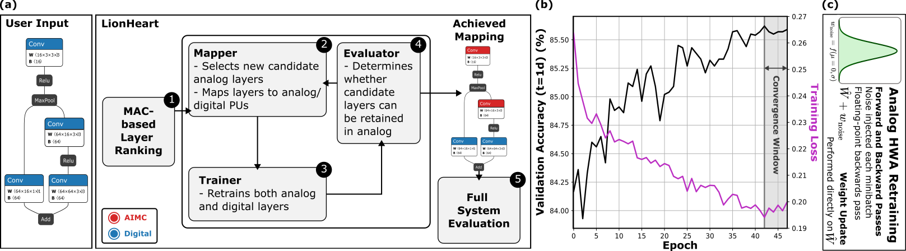

# LionHeart: A Layer-based Mapping Framework for Heterogeneous Systems with Analog In-Memory Computing Tiles
Source code for the framework introduced in [LionHeart: A Layer-based Mapping Framework for Heterogeneous Systems with Analog In-Memory Computing Tiles](https://arxiv.org/pdf/2401.09420), accepted for publication in the IEEE Transactions on Emerging Topics in Computing.



## Abstract
When arranged in a crossbar configuration, resistive memory devices can be used to execute Matrix-Vector Multiplications (MVMs), the most dominant operation of many Machine Learning (ML) algorithms, in constant time complexity. Nonetheless, when performing computations in the analog domain, novel challenges are introduced in terms of arithmetic precision and stochasticity, due to non-ideal circuit and device behaviour. Moreover, these non-idealities have a temporal dimension, resulting in a degrading application accuracy over time. Facing these challenges, we propose a novel framework, named LionHeart, to obtain hybrid analog-digital mappings to execute Deep Learning (DL) inference workloads using heterogeneous accelerators. The accuracy-constrained mappings derived by LionHeart showcase, across different Convolutional Neural Networks (CNNs) and one transformer-based network, high accuracy and potential for speedup. The results of the full system simulations highlight run-time reductions and energy efficiency gains that exceed 6×, with a user-defined accuracy threshold for a fully digital floating point implementation.

## Installation
Clone this repository and install it using:
```
pip install -e .
```

Note: `aihwkit` is required. See https://aihwkit.readthedocs.io/en/latest/install.html for complete installation instructions.

## Examples
Currently, two examples are provided, for:
1. The ResNet20 model and CIFAR-10 dataset, available [here](examples/resnet_cifar10.py); and
2. The MobileBERT model and SQuADv1.1 dataset, available [here](examples/mobilebert_squad.py).

The checkpoint for the ResNet20 model can be generated using [this script](examples/train_resnet.py).
When instantiating the MobileBERT model, pre-trained floating-point weights are automatically fetched and loaded.

## Contributing
To add a new model or dataset, the following abstract classes may be required to extended:
* `from lionheart.datasets.Dataset import Dataset`
* `from lionheart.methods.Method import Method`
* `from lionheart.trainer_evaluator.TrainerEvaluator import TrainEvaluator`

Before creating a PR, please make sure to add/update license headers as follows:
```
go install github.com/google/addlicense@latest
addlicense . -l apache
```

## Citation
If you use LionHeart in  your research, please cite our paper using the following BibTeX entry:
```
@misc{Lammie2024,
      title={{LionHeart: A Layer-based Mapping Framework for Heterogeneous Systems with Analog In-Memory Computing Tiles}}, 
      author={Corey Lammie and Flavio Ponzina and Yuxuan Wang and Joshua Klein and Hadjer Benmeziane and Marina Zapater and Irem Boybat and Abu Sebastian and Giovanni Ansaloni and David Atienza},
      year={2024},
      eprint={2401.09420},
      archivePrefix={arXiv},
      primaryClass={cs.ET},
      url={https://arxiv.org/abs/2401.09420},
      note={To appear in the IEEE Transactions on Emerging Topics in Computing}
}
```


## License
This project is licensed under [Apache License 2.0].

[Apache License 2.0]: LICENSE
